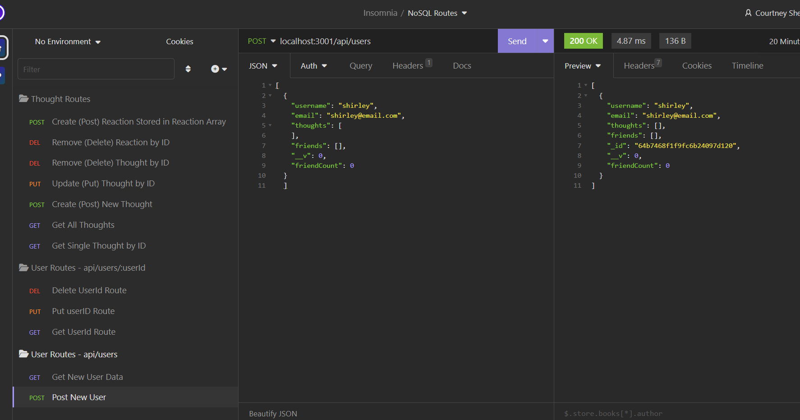

## Description

AS A social media startup
I WANT an API for my social network that uses a NoSQL database
SO THAT my website can handle large amounts of unstructured data

## Demo/Screenshots

  <table>
  <tr>
    <td>NoSQL Project Screenshot</td>
  </tr>
  <tr>
    <td></td>
  </tr>
  </table>

  <table>
  <tr>
    <td>NoSQL Project Video</td>
  </tr>
  <tr>
    <td></td>
  </tr>
  </table>

## Project URL

## Deployment

## Contact

Email: csherman177@gmail.com

## Author

Author(s): Courtney Sherman
GitHub: https://github.com/csherman177/
